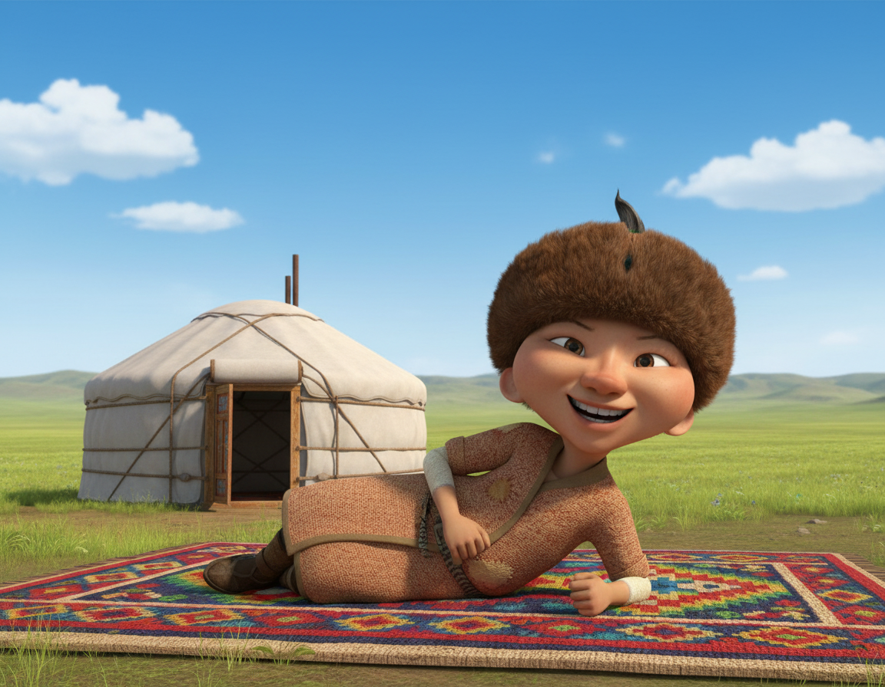
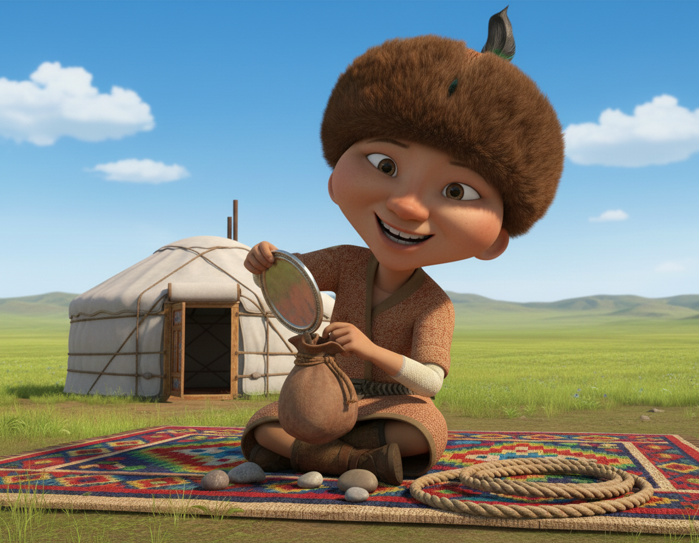
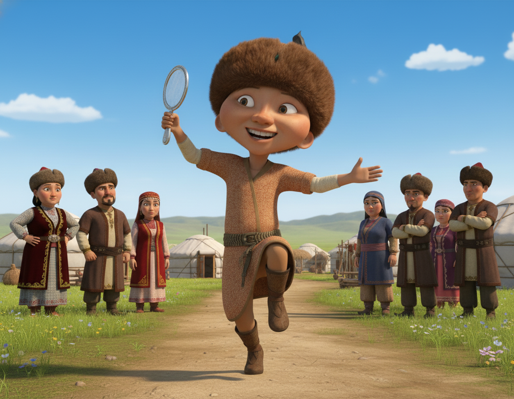
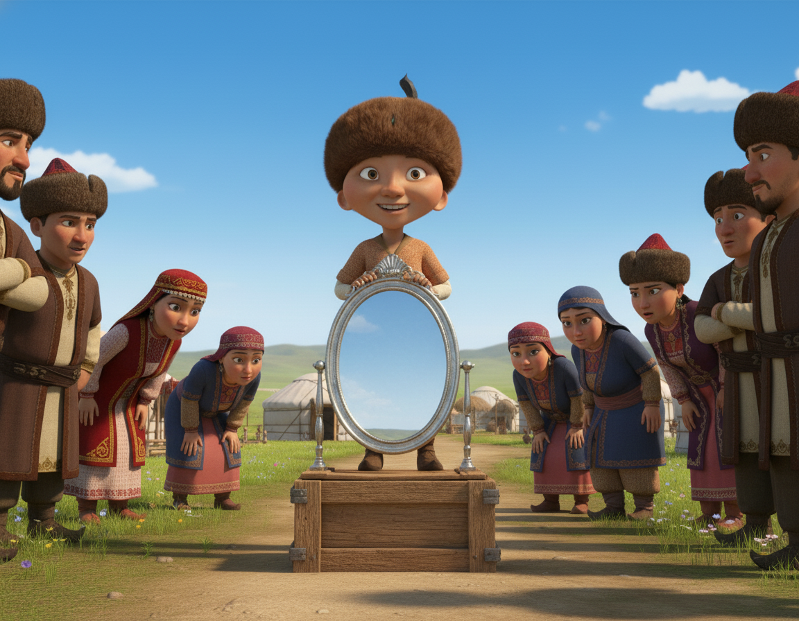
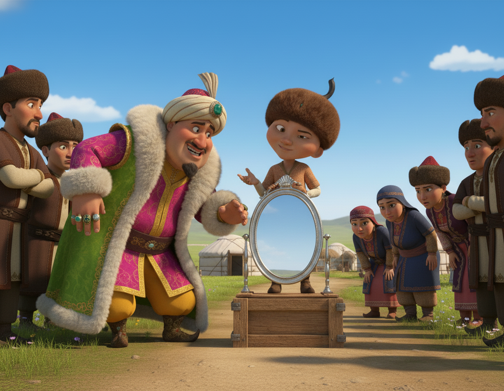
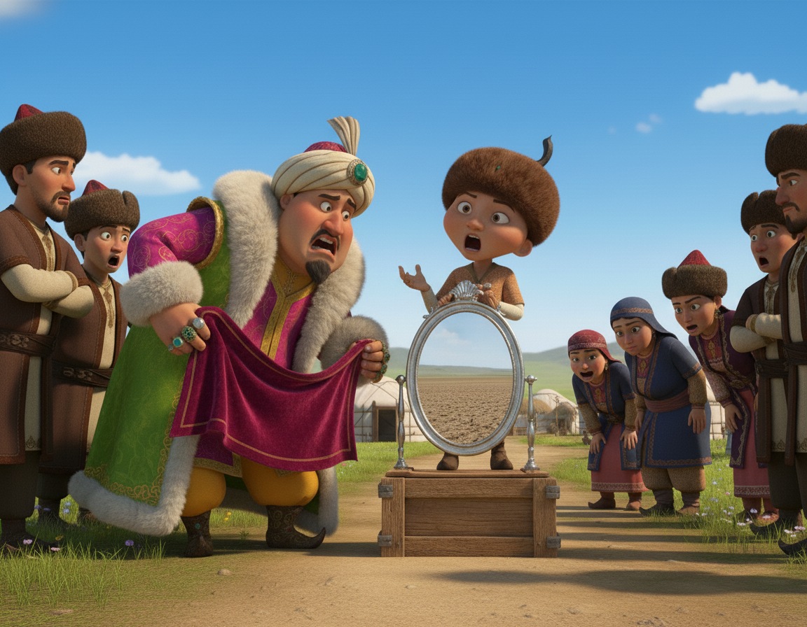
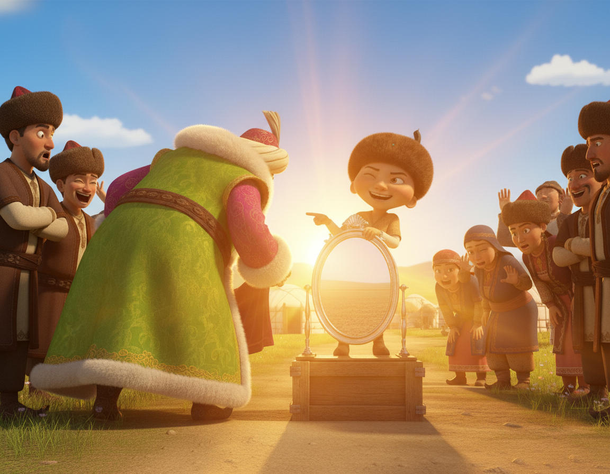
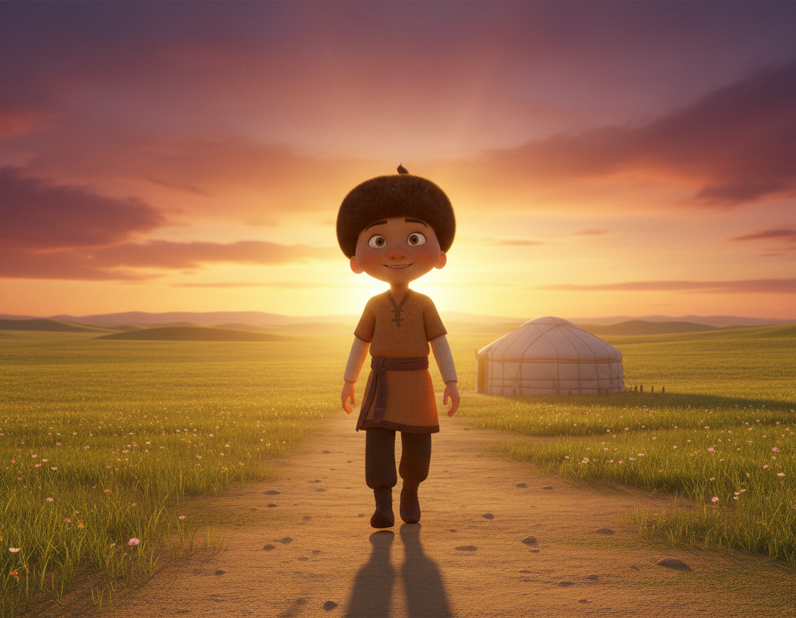

# Aldar Kose Storyboard Generator

A **visual story generation pipeline** that creates **short stories** about Aldar Kose, the legendary Kazakh folk trickster.

This project combines **LLM-based story expansion** with **image generation**, ensuring **character consistency**, **cultural authenticity**, and **visual clarity** in every scene.

---

## 🧩 Pipeline

| Stage | Description | Tools |
|-------|--------------|-------|
| **1. Story Expansion** | Expands 2–4 sentence input into a 300–400 word, 6–10-scene story. | GPT  |
| **2. Scene Chunking** | Splits expanded story into visual scene descriptions. | Python NLP pipeline |
| **3. Image Generation** | Uses diffusion or API-based model to generate each scene. | Stable Diffusion, NanoBanana |
| **4. Character Consistency** | Ensures Aldar Kose looks the same across all scenes. | NanoBanana Prompting or OpenCV, cosine similarity |
| **5. Regeneration Logic** | Regenerates images below similarity threshold (e.g. 0.6). | Python loop |
---

### 🧩 1. LoRA, DreamBooth, IP-adapter

Fine-tune a small adapter layer to personalize Stable Diffusion for Aldar Kose.

**Pros:**
- Lightweight (~50–200MB)
**Cons:**
- Poor image generation
- Low context understanding from previous scenes

### 🧩 2. NanoBanana

Using Google GenAI API we created series of images using their model

**Pros:**
- Low-cost API for generation (~0.02$)
- Fast inference
- Context and character consistency through references
- Simple similarity check using CLIP, if consequent image are not similar in Aldar Kose characterization

## 🚀 Inference

1. **Clone the repository**
   ```bash
   git clone https://github.com/naradey2k/aldar-kose-storyboard.git
   cd aldar-kose-storyboard
   ```
   
2. **Install dependencies**
   ```bash
   pip install -r requirements.txt
   ```

3. **Run the generation**
   ```bash
   python3 story_generation.py --openai-api-key YOUR_OPENAI_API --google-api-key YOUR_GOOGLE_API --prompt YOUR_STORY_PROMPT
   ```

4. **Or just run storyboard_generation.ipynb**

## 🖼️ Generation Results
<p align="center">
  
  
</p>

<p align="center">
  
  
</p>

<p align="center">
  
  
</p>

<p align="center">
  
  
</p>


